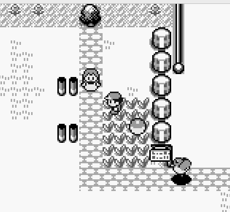
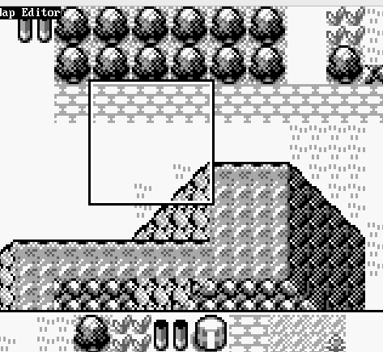
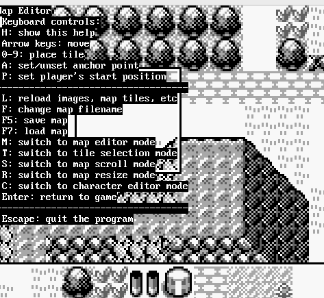
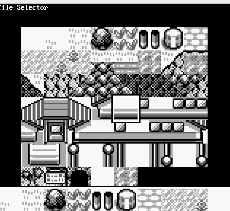
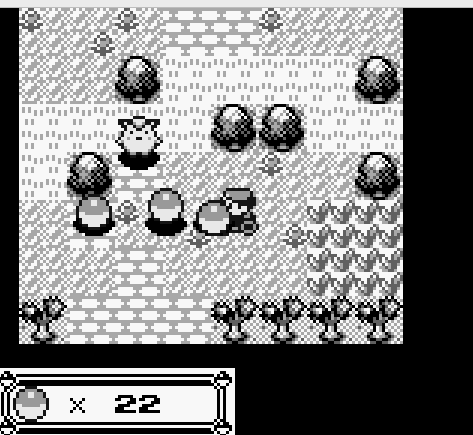
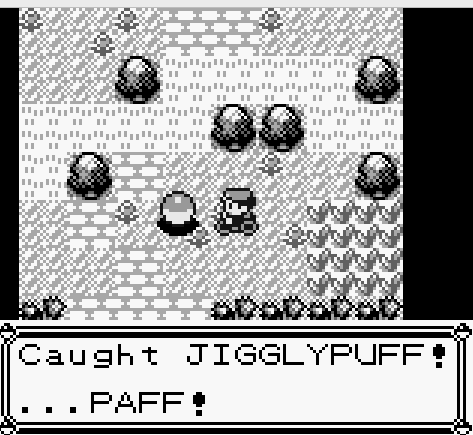
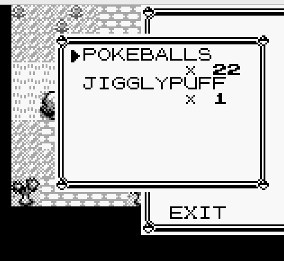
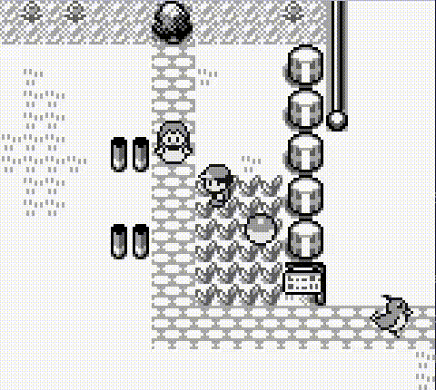

# Mokabon

This is a game engine written from scratch, by me, in QBASIC.

Specifically, I'm using [QB64](https://qb64.com/):
> QB64 is a modern extended BASIC programming language that retains
> QBasic/QuickBASIC 4.5 compatibility and compiles native binaries for
> Windows, Linux, and macOS.

It has a built-in map editor, and a fairly extensive scripting system.

The name "mokabon" rhymes with... uhhh... well, you'll figure it out.
















The source code lives in a single file: [gameboy.bas](gameboy.bas)

The graphics live in this directory: [img/](img/)

All the graphics come from Pokemon Red/Blue.
The rights to character designs, original drawings, etc all belong to
Nintendo.

I got the graphics files from the Spriter's Resource:
https://www.spriters-resource.com/game_boy_gbc/pokemonredblue/


## The scripting system

The game can have one map loaded at any given time.
The maps are generally found under `maps/`, e.g. [maps/test0.txt](maps/test0.txt).
Maps use a text format, but are generally modified using the game's built-in
editor.
Scripts, however, require modifying the map files directly.

The editor lets us create "characters" (i.e. non-player characters, like
other people and pokemon), reposition them, choose what graphics to use for
them, etc.
It's up to us to add scripts to them, using keywords like "loop", "talk",
and "catch".

Here's an example from test0.txt, of a character and its scripts:
```
character
    name PIDGEY
    pokemon
    images  0
    facing r
    position  6  11
    loop                <--- This is a script!
        wait  30
        walk r 1
        jump r
        walk r 1
        wait  30
        walk l 1
        jump l
        walk l 1
    end
    talk                <--- This is a script!
        say SQUAWK!
    end
    catch               <--- This is a script!
        add item PIDGEY  1
        remove
        say Caught PIDGEY!
    end
end
```

And here's what that looks like in the game.
The "loop" script is what makes the pidgey move back and forth; the "talk"
script is what happens when you talk to it; and the "catch" script is what
happens when you hit it with a pokeball.


